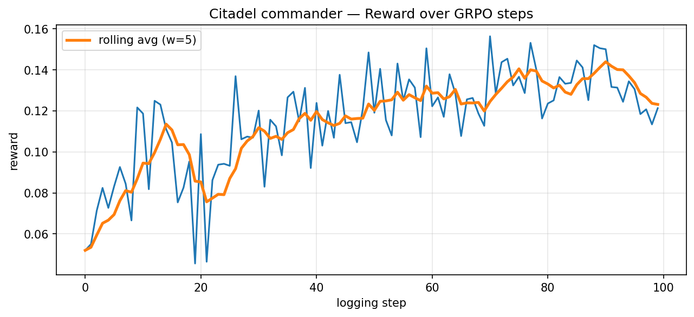

# Citadel — Multi-Agent AI Defense Council

> Bastion defended. Sentinel supervised. **Citadel is an LLM council** that governs, critiques, co-evolves, and earns trust.

**[🚀 Live Demo](https://huggingface.co/spaces/Astro-Dude/citadel)** | **[📊 Training Results](docs/results.md)** | **[📖 Training Guide](docs/training.md)**

### Training Results (Qwen2.5-3B-Instruct, 120 steps GRPO)
| Phase | Before Training | After Training | Improvement |
|-------|----------------|----------------|-------------|
| Commander | -0.326 (env crash) | +0.082 avg | **+0.41** |
| Oversight | -0.145 (wrong reward) | +0.134 avg | **+0.28** |



Citadel is the Round 2 submission for the Meta PyTorch × Scaler OpenEnv Hackathon. It extends our Round 1 project (Bastion) into a full enterprise SOC environment: two LLMs cooperate through a structured critique protocol, under real enterprise governance constraints, against four generations of adversary, while maintaining bidirectional trust and a shared lessons playbook.

## Why a council, not a gate

Most multi-agent oversight work treats the reviewer as a one-token classifier (`approve`/`veto`). That's an oversight *gate*, not an overseer. Fleet AI's mandate — "monitor, **analyze, and explain** the behavior of other AI agents" — demands more. In Citadel, Oversight emits a structured critique every step:

```json
{
  "decision": "approve | revise | veto | flag_for_human",
  "risk_tier": 3,
  "weakness": "isolating database without investigation — alert confidence 22%",
  "missing_evidence": ["no log confirming lateral movement from db"],
  "counter_proposal": {"action": "investigate", "target": "database"},
  "lesson_text": "Alerts <30% confidence on data systems require investigate() before isolate()."
}
```

- On **REVISE**, Commander gets one chance to address the named weakness.
  - **Revision enforcement**: if Commander's revision ignores the `counter_proposal` entirely (different action *and* different target), Oversight auto-escalates to VETO — Commander can't simply re-submit under cover of a nominal revision.
- On **VETO**, Commander must pick a different action next step.
- After every action resolves, Oversight writes a one-line lesson that both agents read in every future episode.

Oversight's per-step observation is structured in four sections, in order:
1. **Independent alert digest** — raw SIEM feed *before* seeing Commander's proposal; Oversight forms its own threat picture first.
2. **Commander's proposal** — action + method/scope/rollback + justification.
3. **Episode history** — Oversight's own past decisions and post-action outcomes (reward, done flag).
4. **Policy checks** — pre-computed governance prerequisite violations.

## Themes hit

| Theme | How Citadel covers it |
|---|---|
| **1 — Multi-Agent Interactions** | Commander + Oversight form an LLM council with separate reward functions |
| ↳ **Fleet AI (Scalable Oversight)** | Oversight analyzes & explains, not just monitors |
| **3.1 — Professional Tasks** | ServiceNow, SOX, PagerDuty, Slack, Data Owner Registry, GDPR timer — real enterprise pre-requisite chains |
| ↳ **Scaler AI Labs (Multi-App Enterprise)** | Governance layer is 6 interacting simulated enterprise systems |
| **4 — Self-Improvement** | Two hooks: (a) adversary curriculum (Gen 1/2/3/4), (b) shared playbook written by Oversight, cited by Commander |
| **5 — Wild Card** | Bidirectional trust dynamics — emergent communication breakdown / high-functioning regimes |

## The environment

- 8-system network (web_server, app_server, database, file_server, email_server, workstations, backup_server, firewall) with adjacency + criticality
- 18 Commander actions (10 incident response + 8 governance)
- **Richer action payloads** — every action carries `method`, `scope`, and `rollback_plan` with real mechanical tradeoffs:
  - `isolate`: `firewall_acl` (reversible, backdoor survives) | `network_unplug` (complete cut, severs backdoor) | `process_kill` (service stays up, 40% chance attacker returns in 1–2h)
  - `patch`: `hotpatch` (no restart, 60% clean) | `cold_patch` (restart, 90% clean) | `virtual_patch` (WAF rule, network-facing only)
  - `deploy_monitoring`: `process_events` | `network_traffic` (improves neighbors) | `auth_events` | `full_endpoint` (max detection, -5% integrity/hour)
- 4 Oversight decisions with structured critique payload
- 4 tasks (easy_1 / medium_1 / hard_1 / hard_2), each with a default adversary generation
- 4 adversary generations — **script kiddie → adaptive → deceptive APT → live LLM adversary**
- Expanded SIEM alert pools: 12 lateral movement + 8 exfiltration + 10 false-positive + 5 privilege escalation templates
- Stakeholder pressure events: CEO / CFO / Legal / Board injections with reputation decay
- Partially observable; compromise status unknown until investigate/hunt

## Quickstart (local)

```bash
pip install -r requirements.txt

export API_BASE_URL=https://router.huggingface.co/v1
export MODEL_NAME=Qwen/Qwen2.5-72B-Instruct
export HF_TOKEN=hf_xxx

python inference.py
```

If no Docker image / HF Space is reachable, `inference.py` falls back to an in-process `LocalEnv`.

## Training

GRPO training runs in two phases (Commander → Oversight). The script auto-detects your hardware and picks the right backend — no manual configuration needed.

| Platform | Backend | Speed | Notes |
|---|---|---|---|
| **Google Colab T4** | Unsloth 4-bit QLoRA | ~15 min/phase | Recommended — free, no setup |
| **Mac (Apple Silicon)** | PEFT + bf16 on MPS | ~2–4 hrs/phase | M1/M2/M3/M4, no GPU needed |
| **Windows / Linux (NVIDIA GPU)** | Unsloth 4-bit QLoRA | ~15–30 min/phase | Any CUDA-capable GPU |
| **CPU-only** | PEFT + fp32 | Very slow | Testing only — not recommended |

### Environment variables

| Variable | Default | Description |
|---|---|---|
| `PHASE` | `both` | `1` (Commander only), `2` (Oversight only), `both` |
| `MAX_STEPS` | `120` | GRPO steps per phase |
| `N_SEEDS` | `6` | Seeds per task/gen combo |
| `SAVE_DIR` | `/content/checkpoints` | Where checkpoints are written |

---

### Google Colab (recommended)

1. Open a new notebook → Runtime → Change runtime type → **T4 GPU**
2. Run these cells:

```python
# Cell 1 — clone
%cd /content
!rm -rf /content/citadel
!git clone https://github.com/Astro-Dude/citadel.git /content/citadel
%cd /content/citadel
```

```python
# Cell 2 — train (deps install automatically)
import os
os.environ["PHASE"]     = "both"           # or "1" / "2"
os.environ["MAX_STEPS"] = "120"
os.environ["N_SEEDS"]   = "6"
os.environ["SAVE_DIR"]  = "/content/checkpoints"

!python training/grpo_train.py
```

```python
# Cell 3 — download results before session expires
from google.colab import files
files.download("/content/checkpoints/commander/reward_curve.png")
files.download("/content/checkpoints/oversight/reward_curve.png")
```

Checkpoints land in `/content/checkpoints/commander/final/` and `/content/checkpoints/oversight/final/`.

---

### Mac (Apple Silicon — M1/M2/M3/M4)

```bash
git clone https://github.com/Astro-Dude/citadel.git && cd citadel

# Install deps (trl, peft, transformers, accelerate — no bitsandbytes needed on MPS)
pip install torch trl peft transformers accelerate datasets matplotlib openai

# Phase 1 — Commander (~2–4 hrs depending on chip)
PHASE=1 MAX_STEPS=120 N_SEEDS=6 SAVE_DIR=./checkpoints python training/grpo_train.py

# Phase 2 — Oversight
PHASE=2 MAX_STEPS=120 N_SEEDS=6 SAVE_DIR=./checkpoints python training/grpo_train.py
```

The script detects MPS automatically and uses bf16. No Unsloth (CUDA-only); PEFT LoRA is used instead. For faster iteration, reduce `MAX_STEPS` to 40–60.

---

### Windows / Linux with NVIDIA GPU

```bash
git clone https://github.com/Astro-Dude/citadel.git && cd citadel

# Install CUDA deps (Unsloth handles the rest automatically at runtime)
pip install torch torchvision torchaudio --index-url https://download.pytorch.org/whl/cu121
pip install trl peft transformers accelerate datasets matplotlib openai bitsandbytes
```

**Windows (PowerShell):**
```powershell
$env:PHASE="both"; $env:MAX_STEPS="120"; $env:N_SEEDS="6"; $env:SAVE_DIR="./checkpoints"
python training/grpo_train.py
```

**Linux (bash):**
```bash
PHASE=both MAX_STEPS=120 N_SEEDS=6 SAVE_DIR=./checkpoints python training/grpo_train.py
```

Unsloth is installed automatically when CUDA is detected. Requires CUDA 11.8+ and ~8 GB VRAM (4-bit QLoRA).

---

### Before/After evaluation (all platforms)

```bash
python training/eval_before_after.py \
    --trained_path ./checkpoints/commander/final \
    --n_episodes 12 \
    --save_dir ./checkpoints/eval
```

Produces `before_after_table.md` and `before_after_chart.png` showing untrained vs trained performance across all 6 metrics.

See [docs/training.md](docs/training.md) for the full guide including model export, loading adapters, and expected metrics.

## Dashboard — live SOC replay

Every run produces a self-contained `runs/dashboard.html` you can open in any browser.
**No server required** — Chart.js and Tailwind load from CDN; all run data is embedded.

Six tabs, one file:

| Tab | What you see |
|---|---|
| **Live Ops** | SIEM terminal · 8-system status grid · Governance + Stakeholders panels · incident timeline scrubber |
| **Council Chat** | Per-step Commander ↔ Oversight cards with connecting line, verdict color-coding, playbook sidebar |
| **Slack** | Full Slack-clone workspace — stakeholder DMs, #soc-alerts, #legal-gdpr, #exec-escalation |
| **Governance** | ServiceNow ticket table · PagerDuty alert feed · CAB approval log |
| **Incident Timeline** | Swim-lane view (SIEM / Decision / Action lanes), fixed label column, step scrubber |
| **Model Performance** | Bento hero metrics · sub-score bar chart · reward curve · oversight decision heatmap |

Use the **step scrubber** (header ‹/›) or **Play/Pause** to replay the full incident.
Load a real run: click **LOAD JSON** and pick any `runs/<run_id>/dashboard.json`.

```bash
# Regenerate dashboard from latest transcripts:
python dashboard.py
```

### Benchmark: Gemma 7B untrained (run `20260419T220811-gemma-7b-untrained`)

| Task | Score | Steps | Termination |
|---|---|---|---|
| `easy_1` | 0.6278 | 12 | normal |
| `medium_1` | 0.2697 | 12 | normal |
| `hard_1` | 0.2860 | 8 | **total_data_breach** |
| **avg** | **0.3945** | — | — |

Gen 3 adversary (deceptive APT) causes catastrophic breach by step 8 on the hardest scenario — exactly the failure mode a trained council is designed to prevent.

## Demo artifact (no-LLM playbook preview)

```bash
python scripts/demo_export.py
```

Writes:
- [playbook_export.md](playbook_export.md) — human-readable playbook grouped by adversary generation
- [playbook_demo.json](playbook_demo.json) — raw lesson state (kept separate from production `playbook.json`)

## Pre-submission validation

- ✅ `openenv validate .` passes (4 deployment modes)
- ✅ `inference.py` in repo root with `[START]/[STEP]/[END]` stdout
- ✅ 4 tasks + graders (scores clamped to [0,1])
- ✅ Dockerfile builds (Python 3.11-slim base)
- ✅ `API_BASE_URL`, `MODEL_NAME`, `HF_TOKEN` env vars (OpenAI client)
- ✅ Runtime <20 min, fits 2 vCPU / 8 GB RAM

```bash
./validate-submission.sh https://astro-dude-citadel.hf.space .
```

## File layout

```
Citadel/
├── models.py               # Pydantic action/obs/state types
├── governance.py           # 6 enterprise-app simulators + pre-req + compliance score
├── trust.py                # Bidirectional trust dynamics (Theme 5)
├── playbook.py             # Shared lessons memory with utility decay (Theme 4)
├── adversary.py            # 3 scripted adversary generations (Theme 4 curriculum)
├── adversary_llm.py        # Gen 4: live LLM adversary (COZY_SKIPPER directive loop)
├── dynamics.py             # Attacker sim + apply_action (method/scope/rollback branches)
├── environment.py          # Two-agent council step loop + feature flags
├── stakeholder_events.py   # CEO/CFO/Legal/Board pressure events
├── ablation.py             # 7-condition feature ablation harness (no LLM, ~0.2s/56 eps)
├── recorder.py             # Per-step transcript + dashboard.json persistence
├── dashboard.py            # Self-contained HTML dashboard generator
├── oversight_env.py        # Oversight-perspective wrapper for Phase 2 training
├── reward.py               # Commander / Oversight / Joint final score
├── baseline.py             # Commander baselines (no_op, naive) + Oversight baselines
├── tasks.py                # 4 scenarios (easy_1/medium_1/hard_1/hard_2)
├── client.py               # CitadelEnv OpenEnv client
├── inference.py            # Drives both LLMs through all tasks
├── investor_agent.py       # Investor/board agent (OpenAI-compat, works with Ollama)
├── server/app.py           # FastAPI server (OpenEnv compliant)
├── docs/
│   ├── design.md           # Architecture & design decisions
│   ├── plan.md             # Module breakdown & implementation status
│   └── training.md         # Training pipeline guide
├── training/
│   ├── grpo_train.py       # Phase 1 + Phase 2 GRPO training script
│   ├── eval_before_after.py# Before/after evaluation
│   └── *.ipynb             # Analysis notebooks
├── scripts/demo_export.py  # No-LLM baseline run → playbook_export.md
├── playbook_export.md      # Pre-committed baseline playbook (judges can read without running)
├── runs/
│   ├── dashboard.html      # Combined 6-tab SOC dashboard (self-contained)
│   └── <run_id>/           # Per-run: transcript.json, transcript.md, dashboard.json
└── Dockerfile, openenv.yaml, pyproject.toml, requirements.txt
```

## Judging angles

- **40% Environment Innovation** — Council protocol + shared playbook + bidirectional trust are each novel; the combination is genuinely unpublished.
- **30% Storytelling** — Demo contrasts untrained pair (trust collapse, bypass, 60% data loss) vs trained pair (clean, governance-compliant, <10% data loss).
- **20% Showing Improvement** — Two reward curves, a 3×generation performance matrix, a trust-evolution plot, a growing playbook (see [playbook_export.md](playbook_export.md) for the untrained baseline).
- **10% Reward / Training Pipeline** — Coherent multi-layer reward with clear ablation hooks; two-phase training (freeze Commander → train Oversight) reuses proven Bastion v1 recipe.

---

Built on top of [Bastion v1](https://huggingface.co/spaces/Astro-Dude/bastion) (Round 1 submission).
