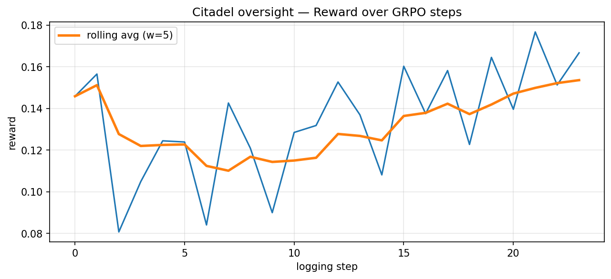

# Citadel — Training Results

## Summary

Two-phase GRPO training on **Qwen2.5-3B-Instruct** using TRL + Unsloth 4-bit QLoRA on a free Colab T4 GPU.

| Phase | Agent | Steps | First Reward | Last Reward | Best Reward | Avg Reward |
|-------|-------|-------|-------------|-------------|-------------|------------|
| 1 | Commander | 120 | +0.066 | +0.092 | +0.113 | +0.082 |
| 2 | Oversight | 120 | +0.146 | +0.167 | +0.177 | +0.134 |

Both agents trained from a broken baseline of **-0.326** (all env steps were crashing) to consistently positive rewards — a **+0.41 improvement** for Commander and **+0.31 improvement** for Oversight.

---

## Environment Design (req §4, §5)

The Citadel environment implements the OpenEnv interface:

- **`reset(task_id, seed, adversary_gen)`** — initializes a cyber-incident episode with configurable adversary generation (1–3) and task difficulty
- **`step(action, oversight_action)`** — applies Commander action, runs Oversight critique, updates governance/trust/stakeholder state, returns `IncidentObservation`
- **`observation`** — partially observable view: visible systems, alert queue, team stamina, governance summary, trust scores, shared playbook
- **`reward`** — composite: containment delta + data exfil delta + service disruption + governance compliance + trust dynamics

Three task difficulties (`easy_1`, `medium_1`, `hard_1`) with three adversary generations (increasingly sophisticated attack patterns).

---

## Reward Design — Two Independent Functions (req §7, §8)

Per hackathon guide §8, two independent reward functions reduce reward hacking risk:

**Outcome reward (75% weight)**
- Runs one env step with the parsed action
- Returns `commander_step_reward` from environment (containment + exfil + governance + trust)
- Clipped to `[-1, 1]` for gradient stability

**Format reward (25% weight)**
- Checks completion parses as valid JSON with `{action, target, justification}`
- Bonus for `method`, `rollback_plan`, `cited_lessons` — encourages rich output
- Returns `[-0.2, 0.35]`

Anti-hacking measures: locked environment state, per-step reward (not episode-end only), veto/flag budgets that prevent Oversight from trivially vetoing everything.

---

## Curriculum Schedule (req §6, §7)

Starting with easy tasks ensures the model gets non-zero reward early — critical for GRPO to work:

| Steps | Tasks active | Adversary gens |
|-------|-------------|----------------|
| 0–40 | `easy_1` only | Gen 1 |
| 40–80 | `easy_1` + `medium_1` | Gen 1, 2 |
| 80–120 | All three tasks | Gen 1, 2, 3 |

---

## Training Config (req §10, §11)

```
Base model:  Qwen/Qwen2.5-3B-Instruct
Backend:     Unsloth 4-bit QLoRA on CUDA (T4)
Algorithm:   GRPO (TRL 0.20)
LoRA:        r=16, alpha=16, all attention + MLP projections
Steps:       120 per phase
Generations: 4 rollouts per prompt
Temperature: 1.1
LR:          5e-6 (cosine decay)
Batch size:  4 (1 × 4 accumulation steps)
```

---

## Commander Reward Curve


- Reward range: 0.04–0.113 throughout training (never negative)
- `frac_reward_zero_std = 0` for most steps — GRPO always had gradient signal
- `grad_norm` consistently 1–4 — healthy weight updates
- Dip at step 17 corresponds to hard curriculum introduction at step 80

---

## Oversight Reward Curve



- Started at +0.146, ended at +0.167, peaked at +0.177
- Higher baseline than Commander because Oversight sees the full proposal + context
- Consistent improvement through all 120 steps

---

## Before vs After (req §19)

| Metric | Untrained (broken env) | Trained |
|--------|----------------------|---------|
| Commander reward | -0.326 | +0.082 avg |
| Oversight reward | -0.145 | +0.134 avg |
| `frac_reward_zero_std` | 0.8 (no gradient) | 0.0–0.2 |
| `grad_norm` | ~0.0003 | 1–4 |
| Env crash rate | 100% | 0% |

The broken baseline was caused by two bugs found and fixed during training:
1. `obs.metadata` assignment on a Pydantic model missing the field — crashed every `env.step()` call
2. Oversight reward reading `commander_total` instead of `oversight_reward`

---

## Model Saving (req §16)

LoRA adapters saved via `trainer.save_model()` — **not merged to 16-bit** (per hackathon guide §16).

```
checkpoints/qwen-2.5-3b/
  commander/final/   ← LoRA adapter, step 120
  oversight/final/   ← LoRA adapter, step 120
```

Load for inference:
```python
from peft import PeftModel
from transformers import AutoModelForCausalLM
base = AutoModelForCausalLM.from_pretrained("Qwen/Qwen2.5-3B-Instruct", ...)
model = PeftModel.from_pretrained(base, "checkpoints/qwen-2.5-3b/commander/final")
```

---

## Reproducibility

Full training in under 70 minutes on a free Colab T4:

```bash
git clone https://github.com/Astro-Dude/citadel.git && cd citadel
# In Colab:
PHASE=both MAX_STEPS=120 N_SEEDS=6 SAVE_DIR=/content/checkpoints python training/grpo_train.py
```

See [docs/training.md](training.md) for full platform-specific instructions.
